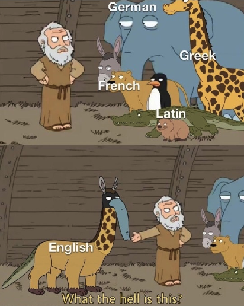

# ConLoan: A Contrastive Multilingual Dataset for Evaluating Loanwords

<p align="center" width="100%">
  <figure>
  
  <figcaption style="text-align: left;">An Internet meme (from Reddit) on borrowing</figcaption>
  </figure>
</p>

ConLoan is a novel contrastive dataset comprising sentences with and without loanwords across 10 languages, namely **Chinese, French, German, Greek, Icelandic, Italian, Northern Kurdish, Portuguese, Russian** and **Spanish**. This repository contains the data, code, and resources from the paper "ConLoan – A Contrastive Multilingual Dataset for Evaluating Loanwords" published at ACL 2025.

## Dataset Overview

The repository contains two main data folders:

- [**`annotations/`**](annotations/): Raw annotations from individual annotators (per language)
- [**`datasets/`**](datasets/): Processed contrastive sentence pairs in JSON format and TSV files with replacements. Here are the data files per Language:
  - **JSON files**: Contain contrastive sentence pairs with loanwords and their native replacements
  - **`*_all_replacements.tsv`**: All annotated loanword replacements, including cases where loanwords were not replaced
  - **`*_replaced_loanwords.tsv`**: Only cases where loanwords were successfully replaced with native alternatives

| Language | Annotations (JSON) | All Replacements (TSV) | Replaced Loanwords (TSV) |
|----------|-----------|------------------------|--------------------------|
| Chinese | [`datasets/Chinese.json`](datasets/Chinese.json) | [`datasets/Chinese_all_replacements.tsv`](datasets/Chinese_all_replacements.tsv) | [`datasets/Chinese_replaced_loanwords.tsv`](datasets/Chinese_replaced_loanwords.tsv) |
| French | [`datasets/French.json`](datasets/French.json) | [`datasets/French_all_replacements.tsv`](datasets/French_all_replacements.tsv) | [`datasets/French_replaced_loanwords.tsv`](datasets/French_replaced_loanwords.tsv) |
| German | [`datasets/German.json`](datasets/German.json) | [`datasets/German_all_replacements.tsv`](datasets/German_all_replacements.tsv) | [`datasets/German_replaced_loanwords.tsv`](datasets/German_replaced_loanwords.tsv) |
| Greek | [`datasets/Greek.json`](datasets/Greek.json) | [`datasets/Greek_all_replacements.tsv`](datasets/Greek_all_replacements.tsv) | [`datasets/Greek_replaced_loanwords.tsv`](datasets/Greek_replaced_loanwords.tsv) |
| Icelandic | [`datasets/Icelandic.json`](datasets/Icelandic.json) | [`datasets/Icelandic_all_replacements.tsv`](datasets/Icelandic_all_replacements.tsv) | [`datasets/Icelandic_replaced_loanwords.tsv`](datasets/Icelandic_replaced_loanwords.tsv) |
| Italian | [`datasets/Italian.json`](datasets/Italian.json) | [`datasets/Italian_all_replacements.tsv`](datasets/Italian_all_replacements.tsv) | [`datasets/Italian_replaced_loanwords.tsv`](datasets/Italian_replaced_loanwords.tsv) |
| Northern Kurdish | [`datasets/Northern-Kurdish.json`](datasets/Northern-Kurdish.json) | [`datasets/Northern-Kurdish_all_replacements.tsv`](datasets/Northern-Kurdish_all_replacements.tsv) | [`datasets/Northern-Kurdish_replaced_loanwords.tsv`](datasets/Northern-Kurdish_replaced_loanwords.tsv) |
| Portuguese | [`datasets/Portuguese.json`](datasets/Portuguese.json) | [`datasets/Portuguese_all_replacements.tsv`](datasets/Portuguese_all_replacements.tsv) | [`datasets/Portuguese_replaced_loanwords.tsv`](datasets/Portuguese_replaced_loanwords.tsv) |
| Russian | [`datasets/Russian.json`](datasets/Russian.json) | [`datasets/Russian_all_replacements.tsv`](datasets/Russian_all_replacements.tsv) | [`datasets/Russian_replaced_loanwords.tsv`](datasets/Russian_replaced_loanwords.tsv) |
| Spanish | [`datasets/Spanish.json`](datasets/Spanish.json) | [`datasets/Spanish_all_replacements.tsv`](datasets/Spanish_all_replacements.tsv) | [`datasets/Spanish_replaced_loanwords.tsv`](datasets/Spanish_replaced_loanwords.tsv) |

You can also find the loanword lists collected per language from sources reported in the paper (mainly Wiktionary) in the [**`loanwords/`**](loanwords/) folder.

## Annotation Guidelines

For detailed information about the annotation process and guidelines used in creating this dataset, see [`loanword_annotation_guide.md`](loanword_annotation_guide.md).

## Code Files

| File | Description |
|------|-------------|
| [`analyze.py`](analyze.py) | General analysis utilities for the ConLoan dataset |
| [`create_corpus.py`](create_corpus.py) | Script for creating the corpus from raw annotations |
| [`donor.py`](donor.py) | Analysis of donor language distributions |
| [`data.json`](data.json) | Configuration file or metadata |
| [`AppScripts/`](AppScripts/) | Google Apps Script code used for annotation spreadsheets |
| [`experiments/surprisal.py`](experiments/surprisal.py) | Language model surprisal analysis |
| [`experiments/t-test.py`](experiments/t-test.py) | Statistical significance testing for surprisal differences |
| [`experiments/ridge_plot.R`](experiments/ridge_plot.R) | R script for creating ridge plots (density visualizations) |

The [`experiments/`](experiments/) folder contains scripts and results for the experiments described in the paper.

## Citation

If you're using this project, please cite [this paper]():

```
  @inproceedings{ahmadi2025conloan,
   title = {ConLoan--A Contrastive Multilingual Dataset for Evaluating Loanwords},
   author = {
    Ahmadi, Sina and,
    Hess, Micha David  and,
    Álvarez Mellado, Elena  and,
    Battisti, Alessia and,
    Ding, Cui and,
    Göhring, Anne and,
    Gao, Yingqiang and,
    Jiang, Zifan and,
    Michail, Andrianos and,
    Morad, Peshmerge and,
    Niklaus, Joel and,
    Panagiotopoulou, Maria Christina and,
    Perrella, Stefano and,
    Opitz, Juri and,
    Shaitarova, Anastassia and,
    Sennrich, Rico
    },
   publisher = {Association for Computational Linguistics},
   year = {2025},
}
```

## License

This project is fully open-source with the permissive [MIT license](LICENSE).
